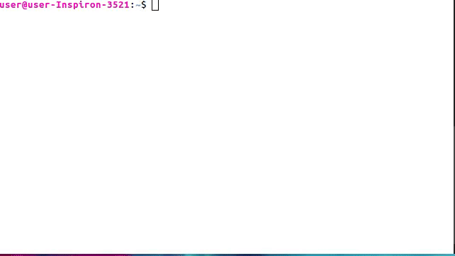

#  nCrypter
---


N-Crypter is simple standalone Text encryption/decryption tool
wriiten in GCC C++


> note :this is a simple encrypter anyone with source code could simply decrypt it !
this is a fun project , sorry for bugs

### installation
---
```bash
$ git clone https://github.com/n1ved/ncrypter.git
$ cd ncrypter
$ sudo python3 install.py 

```
### Excicution
---
```bash
$ ncrypter

```
###   [version 1.1 [25/09/2020]
    - [x]New installer script ! installs the program as linux command ( just copying binary file to /bin/ :D )
    - [x]Removed start.py (Replaced by install.py)
    
    
### Prerequsties
---
> g++ &
> python(optional)

### How this works

this program simply change every text to its ASCII value and change that ASCII value and reconverting to Text

```cpp
for(i=1;i<(ConvLimit-1);i++){

 if (str[i]=='\0')//used for removing occational segmentation faults
     break;

 key=i%4;

 /*  the key will choose How much possitions does the letter deviates .
     for example if key is 1, A will be converted to B  */

 num=str[i]; //letter to ASCII

  switch (key) { //converting to next charecter
      case 0 :num++;
              break;
      case 1 :num +=2;
              break;
      case 2 :num += 3;
              break;
      case 3 :num+= 4;
            break;
  }


  str[i]=num;//ASCII to letter

  cout<<str[i];//print new letter

```

the decryption is also work in almost same way the only change is while encryption
convert the charecter to next ones decrytion converts it to previous one

