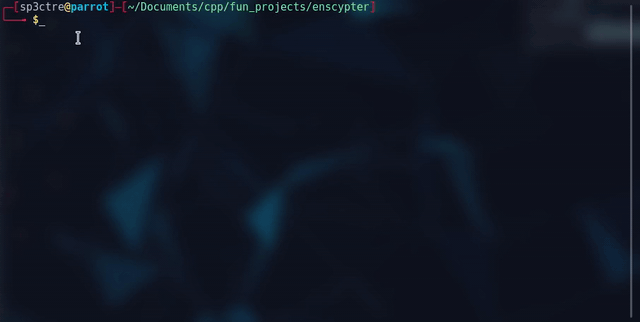

#  ncrypter
---


N-Crypter v-0.0.1.0 alpha

simple text encryping application

wriiten in GCC C++

    
> note :this is a simple encrypter anyone with source code could simply decrypt it !

this is a fun project , sorry for bugs 
### Running
---
just open the terminal in this folder and run ```$ python start.py```

### Prerequsties
---
> g++ 
-  install this by 
```$ sudo apt-get install g++ ```
> python
- install by
```$ sudo apt-get install python```

## usage notes
  * do not use whitespace instead please use hyphen (-)
  * text limit is 150 charecters 
